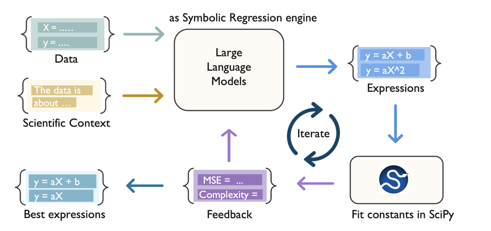

# In Context Learning and Reasoning for Symbolic Regression with Large Language Models

The study leverages LLMs for discovering equations directly from data while incorporating contextual cues provided in natural language.

 

This repository includes 3 Jupyter Notebooks that showcase the different methods used in the paper:

  - generalWorkflow.ipynb: General workflow for datasets - Bode, Hubble, Kepler, and Langmuir.
    Uses prompt_ADSC.py, fittingClass_general.py and experiment.py
  
  - DS_langmuir.ipynb: Workflow for dual-site Langmuir dataset.
    Uses prompt_ADSC.py, fittingClass_ds_lang.py and ds_langmuir class from experiment.py
    
  - nikuradse.ipynb: Workflow for Nikuradse dataset.
    Uses prompt_nikuradse_p3.py, fittingClass_nik.py, and nikuradse class from experiment.py

The specific OpenAI GPT models used in this work are: `gpt-4-0613` and `gpt-4o-2024-08-06` 

